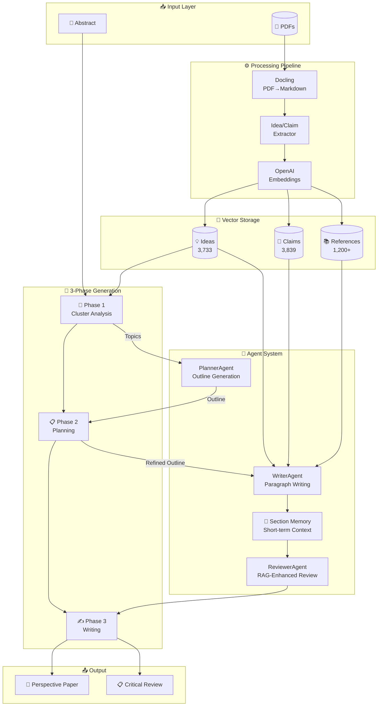

# TheAIWriter

🤖 AI-powered academic writing system specialized in **perspective papers**. Uses a 3-phase architecture with semantic search over curated reference embeddings.

[](https://www.python.org/downloads/)
[](https://opensource.org/licenses/MIT)

## 🎯 Overview

TheAIWriter generates high-quality perspective papers by:
1. **Analyzing** your reference corpus through semantic clustering
2. **Planning** a detailed outline with paragraph-level ideas
3. **Writing** each paragraph with targeted semantic search for evidence

## 🏗️ Architecture



## ✨ Features

- **🔬 Semantic Clustering**: Extracts main topics from embedding space using KMeans
- **📋 Intelligent Planning**: Generates detailed outlines with paragraph-level key ideas
- **✍️ Targeted Writing**: Each paragraph gets context from semantic search on its specific idea
- **🔄 RAG-Enhanced Review**: Reviewer searches for supporting/counter evidence
- **📝 Section Memory**: Maintains coherence across sections with summaries
- **📊 Pipeline Logging**: Full traceability of generation process

## 📦 Installation

```bash
# Clone the repository
git clone https://github.com/your-username/TheAIWriter.git
cd TheAIWriter

# Create virtual environment
python -m venv .venv
source .venv/bin/activate  # Linux/Mac
# .venv\Scripts\activate   # Windows

# Install dependencies
pip install -e .

# Configure API keys
cp .env.example .env
# Edit .env with your OPENAI_API_KEY
```

## 🚀 Usage

### Command Line Interface

```bash
# Generate a perspective paper
python -m ai_writer generate "Hacia Agentes Empáticos Fundamentales"

# Generate with custom options
python -m ai_writer generate "Paper Title" -c 30 -r 2 -o ./output/

# Generate only the outline
python -m ai_writer outline "Paper Title"

# Review an existing paper
python -m ai_writer review ./paper.md

# Show configuration
python -m ai_writer version

# Process new PDFs into the index
python -m ai_writer process --input ./new_papers/
```

### CLI Options

| Command | Description |
|---------|-------------|
| `generate` | Generate a complete perspective paper |
| `outline` | Generate only the structured outline |
| `review` | Generate critical review of existing paper |
| `process` | Process PDFs and build embedding indices |
| `stats` | Show embedding index statistics |
| `version` | Show configuration and version info |

### Generate Options

| Option | Default | Description |
|--------|---------|-------------|
| `-c, --clusters` | 25 | Number of clusters for topic extraction |
| `-r, --reviews` | 1 | Review iterations per section |
| `-o, --output` | `data/output/final/` | Output directory |
| `-a, --abstract` | `ABSTRACT.md` | Path to abstract file |
| `--no-log` | False | Disable pipeline logging |

## 📁 Project Structure

```
TheAIWriter/
├── src/ai_writer/
│   ├── agents/           # AI agents (planner, writer, reviewer)
│   ├── orchestrators/    # 3-phase pipeline orchestration
│   ├── embeddings/       # Embedding management
│   ├── processors/       # PDF processing pipeline
│   ├── readers/          # Document readers
│   ├── writers/          # Document writers
│   ├── models/           # Data models (Paper, Outline)
│   └── utils/            # Cluster analysis, context manager
├── data/
│   ├── references/       # Source PDFs and markdown
│   ├── processed/        # Embeddings and indices
│   ├── logs/             # Pipeline execution logs
│   └── output/           # Generated papers
├── config/               # Settings and configuration
├── docs/                 # Architecture documentation
└── tests/                # Test suite
```

## ⚙️ Configuration

Create a `.env` file:

```env
OPENAI_API_KEY=your-api-key-here
```

Models are configured in `config/settings.py`:

```python
default_model = "gpt-5.2"      # Main generation model
reasoning_model = "gpt-5.2"    # Complex reasoning tasks
fast_model = "gpt-5.2"         # Quick operations
embedding_model = "text-embedding-3-small"
```

## 📊 Embedding Indices

The system uses pre-built indices from processed papers:

| Index | Items | Description |
|-------|-------|-------------|
| Ideas | 3,733 | Key ideas extracted from papers |
| Claims | 3,839 | Specific claims with evidence |
| References | 1,200+ | Bibliographic references |

## 🔄 Pipeline Phases

### Phase 1: Cluster Analysis
- Loads embedding indices
- Applies KMeans clustering (default: 25 clusters)
- Extracts representative topics from each cluster

### Phase 2: Planning
- PlannerAgent generates structured outline
- Each section has paragraphs with key ideas
- ReviewerAgent refines outline (conservative changes)

### Phase 3: Writing
- Writes paragraph-by-paragraph
- Each paragraph gets targeted semantic search context
- Section summaries maintain coherence
- RAG-enhanced review strengthens arguments

## 📝 Output

Generated files in `data/output/final/`:
- `Paper_Title.md` - The perspective paper
- `Paper_Title_critical_review.md` - Critical analysis

Logs in `data/logs/run_*/`:
- `phase1_topics.json` - Extracted cluster topics
- `phase2_outline.json` - Generated outline
- `outline_feedback_*.json` - Reviewer feedback
- `run_log.json` - Execution metadata

## 🧪 Development

```bash
# Install dev dependencies
pip install -e ".[dev]"

# Run tests
pytest

# Run linting
ruff check src/
```

## 📄 License

MIT License - see [LICENSE](LICENSE) for details.

---

Built with ❤️ using OpenAI GPT models and semantic embeddings.
