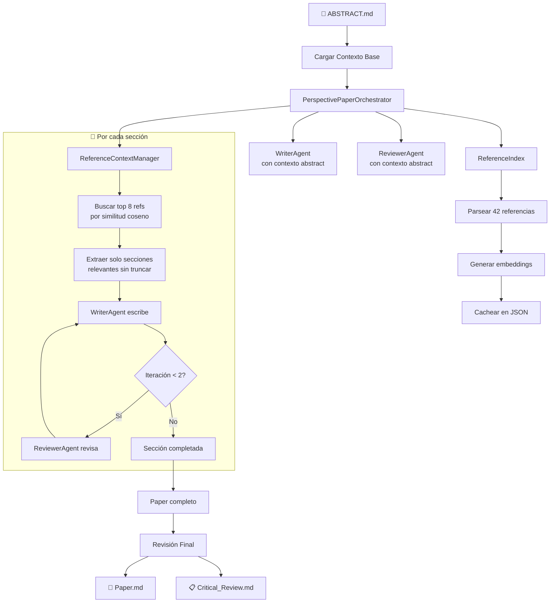
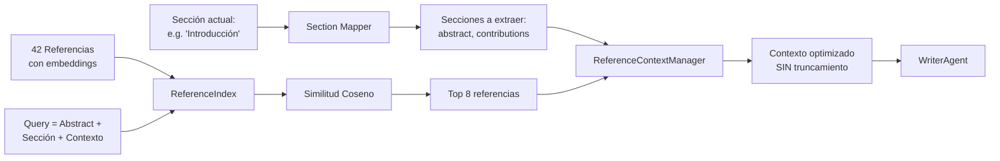
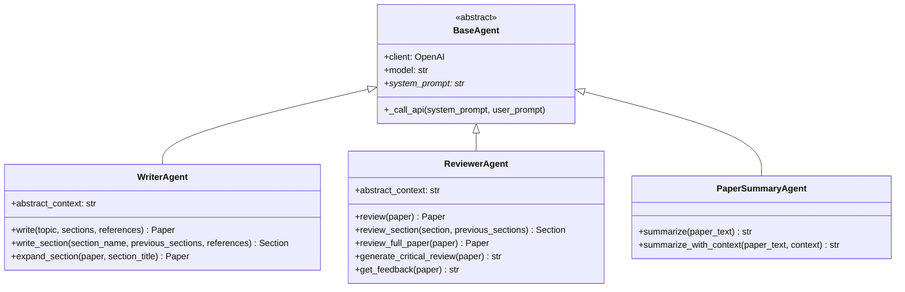
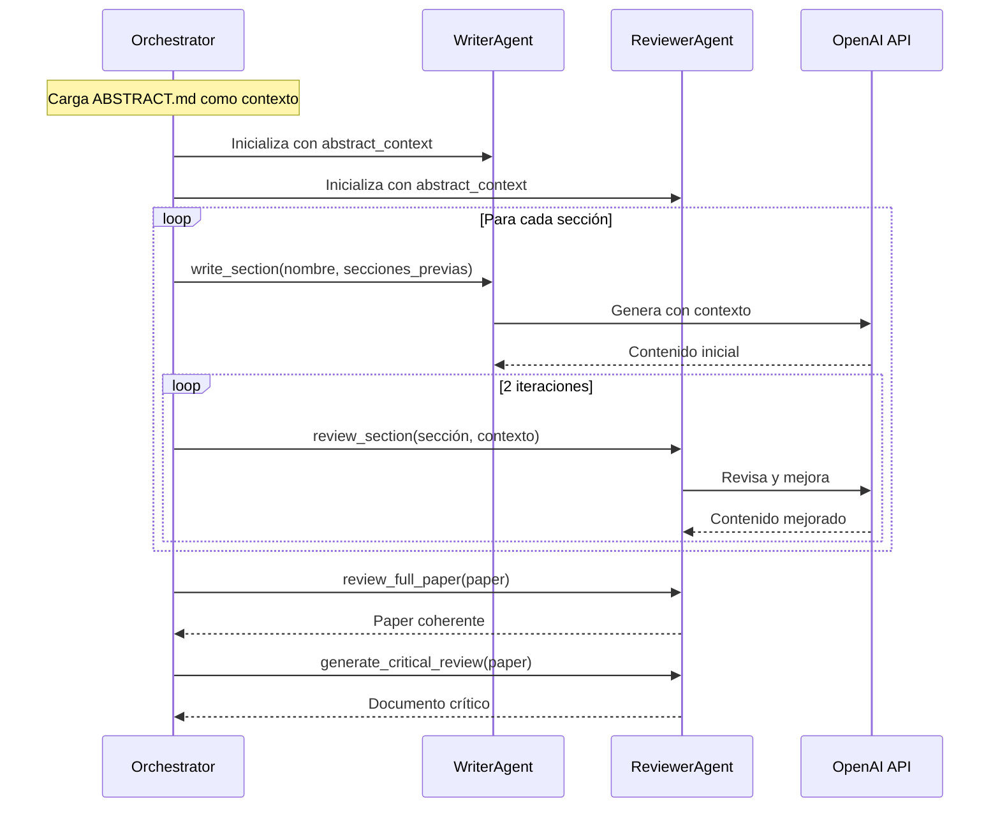
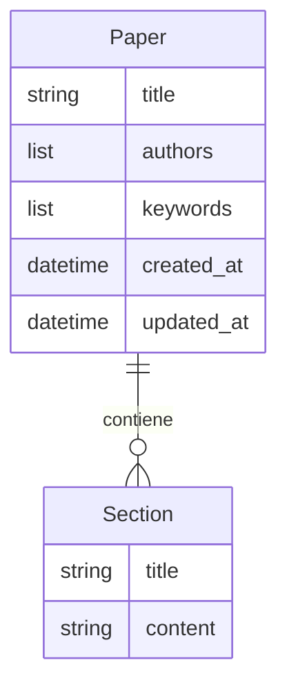

# TheAIWriter - Arquitectura del Sistema

## 📋 Resumen

TheAIWriter es un sistema de escritura académica asistida por IA especializado en **papers de perspectivas**. Utiliza agentes especializados para generar, revisar iterativamente y exportar papers científicos manteniendo coherencia con un abstract base.

---

## 🎯 Flujo Principal: Paper de Perspectivas



---

## 🔍 Sistema de Selección Inteligente de Referencias



### Mapeo Sección → Referencias

| Sección del Paper | Secciones de Referencia |
|-------------------|------------------------|
| Introducción | abstract, contributions |
| Estado del Arte | abstract, contributions, methodology, results |
| Identificación del Problema | limitations, future_work, contributions |
| La Nueva Perspectiva | contributions, methodology, results, notes |
| Discusión | results, notes, limitations, quotes |
| Implicaciones Futuras | future_work, results, contributions |
| Desafíos y Limitaciones | limitations, future_work |
| Conclusiones | abstract, results, quotes, contributions |

---

## 📚 Estructura de un Paper de Perspectivas

| Orden | Sección | Descripción |
|-------|---------|-------------|
| 0 | **Abstract** | Proporcionado por el usuario (no generado) |
| 1 | Introducción | Contexto y objetivos |
| 2 | Estado Actual del Arte | Revisión de literatura |
| 3 | Identificación del Problema | La brecha a abordar |
| 4 | La Nueva Perspectiva | Propuesta central |
| 5 | Discusión | Argumentación detallada |
| 6 | Implicaciones Futuras | Hoja de ruta |
| 7 | Desafíos y Limitaciones | Reconocimiento honesto |
| 8 | Conclusiones | Síntesis final |
| 9 | Conflicto de Intereses | Declaración formal |
| 10 | Agradecimientos | Reconocimientos |
| 11 | Referencias | Bibliografía |

---

## 🏗️ Arquitectura de Agentes



---

## 🔄 Proceso Iterativo de Escritura-Revisión



---

## 📦 Modelo de Datos



---

## 🎯 Componentes Principales

| Componente | Responsabilidad |
|------------|-----------------|
| `PerspectivePaperOrchestrator` | Orquesta el flujo completo de paper de perspectivas |
| `ReferenceIndex` | Índice de referencias con embeddings cacheados |
| `ReferenceContextManager` | Selección inteligente de referencias por sección |
| `ReferenceParser` | Parsea markdown estructurado en secciones |
| `WriterAgent` | Genera contenido académico con contexto del abstract |
| `ReviewerAgent` | Revisa secciones y genera documento crítico |
| `MarkdownReader` | Lee referencias y abstract |
| `MarkdownWriter` / `PDFWriter` | Exporta el paper final |

---

## 📁 Estructura de Directorios

```
TheAIWriter/
├── src/ai_writer/
│   ├── agents/              # Agentes de IA
│   │   ├── base_agent.py
│   │   ├── writer_agent.py  # Escritura con contexto
│   │   └── reviewer_agent.py # Revisión iterativa
│   ├── orchestrators/       # Orquestadores de flujo
│   │   └── perspective_paper_orchestrator.py
│   ├── models/              # Modelos de datos
│   │   ├── paper.py
│   │   └── reference.py     # ParsedReference
│   ├── utils/               # Utilidades
│   │   ├── reference_parser.py      # Parser de markdown
│   │   ├── reference_index.py       # Índice con embeddings
│   │   └── reference_context_manager.py  # Selector inteligente
│   ├── readers/             # Lectores
│   ├── writers/             # Exportadores
│   └── scripts/             # Scripts ejecutables
│       └── generate_perspective_paper.py
├── config/                  # Configuración
├── data/
│   ├── references/
│   │   └── markdown/
│   │       ├── ABSTRACT.md          # ⭐ Abstract base (requerido)
│   │       ├── reference_index.json # 📦 Cache de embeddings
│   │       └── *.md                 # Referencias parseadas
│   └── output/
│       └── drafts/          # Papers generados
└── docs/                    # Documentación
```

---

## 🚀 Uso

```bash
# Generar un paper de perspectivas
python -m ai_writer.scripts.generate_perspective_paper
```

**Requisitos:**
1. Archivo `data/references/markdown/ABSTRACT.md` con el abstract del paper
2. Referencias estructuradas en `data/references/markdown/*.md`

**Primera ejecución:**
- Parsea todas las referencias
- Genera embeddings (1 llamada API por lote de 100)
- Cachea en `reference_index.json`

**Ejecuciones siguientes:**
- Carga directamente del cache (instantáneo)
