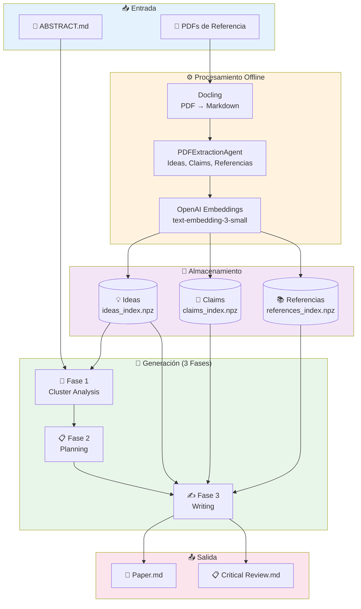
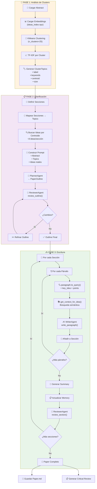
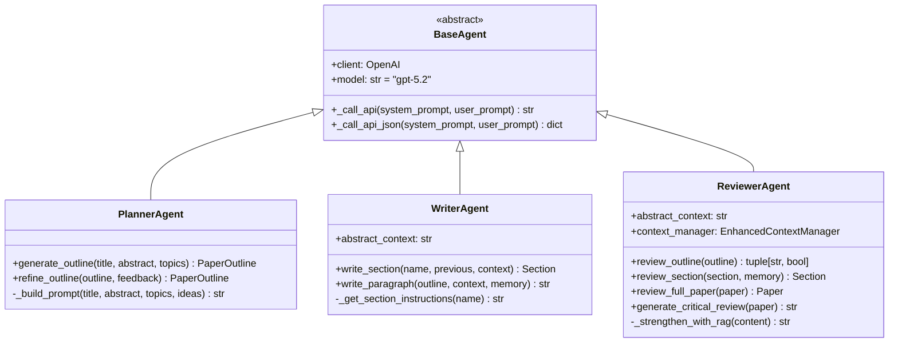
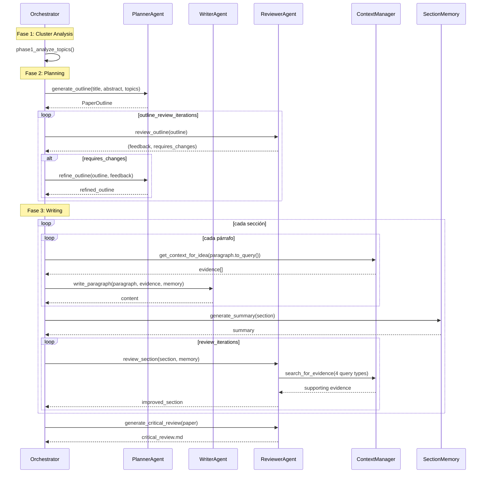
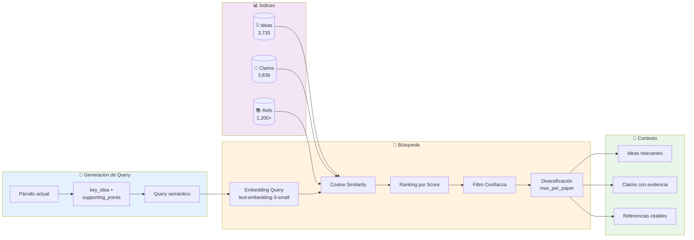
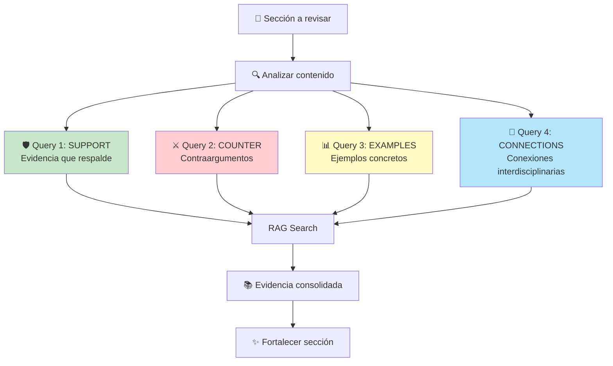
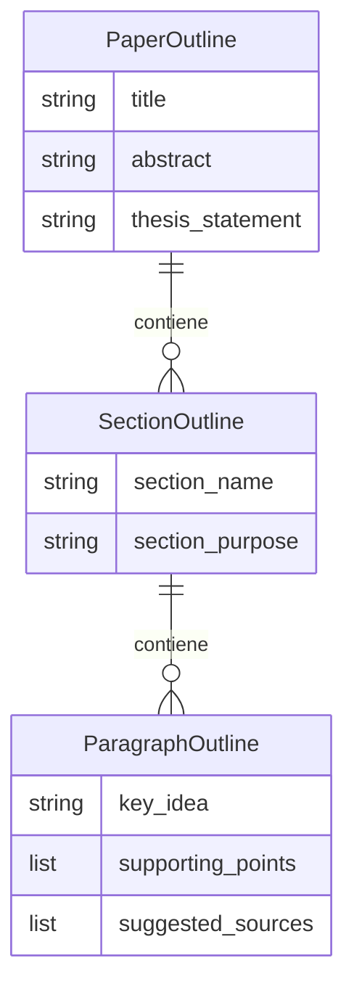
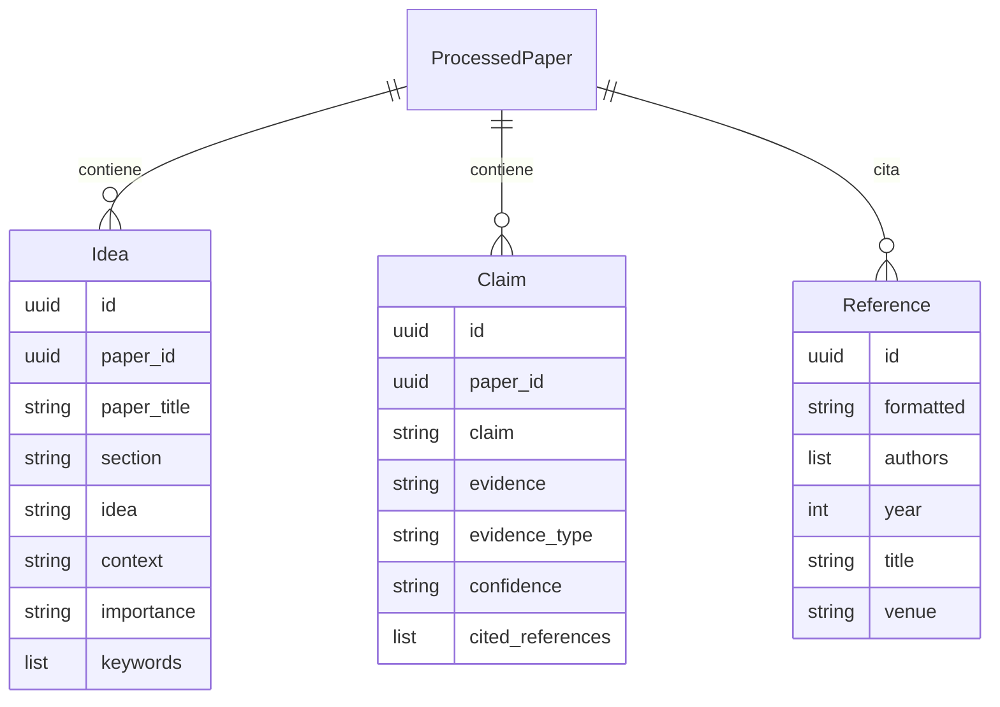

# TheAIWriter - Arquitectura del Sistema

> Sistema de escritura académica asistida por IA especializado en **papers de perspectivas**.  
> Versión: 1.0.0 | Última actualización: Enero 2026

## 📋 Índice

1. [Visión General](#-visión-general)
2. [Arquitectura de Alto Nivel](#-arquitectura-de-alto-nivel)
3. [Pipeline de 3 Fases](#-pipeline-de-3-fases)
4. [Sistema de Agentes](#-sistema-de-agentes)
5. [Sistema RAG](#-sistema-rag)
6. [Modelos de Datos](#-modelos-de-datos)
7. [Estructura del Proyecto](#-estructura-del-proyecto)
8. [CLI y Uso](#-cli-y-uso)

---

## 🎯 Visión General

TheAIWriter genera papers académicos de perspectiva utilizando:

- **Análisis de Clusters**: Extrae temas principales del espacio de embeddings
- **Planificación Inteligente**: Genera outlines detallados párrafo por párrafo
- **RAG-Enhanced Writing**: Cada párrafo busca evidencia específica
- **Revisión Iterativa**: ReviewerAgent fortalece argumentos con evidencia adicional
- **Memoria de Sección**: Mantiene coherencia entre secciones

### Métricas del Sistema

| Recurso | Cantidad |
|---------|----------|
| Ideas indexadas | 3,733 |
| Claims indexados | 3,839 |
| Referencias indexadas | 1,200+ |
| Papers procesados | 41 |
| Dimensiones embedding | 1,536 |

---

## 🏗️ Arquitectura de Alto Nivel



---

## 🔬 Pipeline de 3 Fases

### Diagrama Detallado del Pipeline



### Descripción de Fases

#### Fase 1: Cluster Analysis
1. Carga embeddings de ideas (3,733 vectores × 1,536 dims)
2. Aplica KMeans con `n_clusters=25`
3. Extrae keywords con TF-IDF por cluster
4. Genera `ClusterTopic` con label, keywords, centroid y tamaño

#### Fase 2: Planning
1. Define 8 secciones estándar de paper de perspectivas
2. Mapea cada sección a topics relevantes
3. Busca ideas cercanas a centroids (`cosine_similarity`)
4. PlannerAgent genera outline estructurado
5. ReviewerAgent valida (cambios conservadores)

#### Fase 3: Writing
1. Para cada párrafo del outline:
   - Genera query semántico desde `key_idea + supporting_points`
   - Busca contexto específico (NO usa abstract genérico)
   - WriterAgent escribe párrafo fundamentado
2. Genera summary de sección para memoria
3. ReviewerAgent revisa sección completa

---

## 🤖 Sistema de Agentes

### Diagrama de Clases



### Flujo de Interacción



---

## 🔍 Sistema RAG

### Arquitectura de Búsqueda



### RAG en ReviewerAgent

El ReviewerAgent usa 4 tipos de queries para fortalecer argumentos:



---

## 📦 Modelos de Datos

### Estructura del Outline



### Datos Extraídos



---

## 📁 Estructura del Proyecto

```
TheAIWriter/
├── src/ai_writer/
│   ├── main.py                    # CLI con Typer
│   ├── __main__.py                # Entry point
│   │
│   ├── agents/                    # 🤖 Agentes de IA
│   │   ├── base_agent.py          # Clase base abstracta
│   │   ├── planner_agent.py       # Generación de outlines
│   │   ├── writer_agent.py        # Escritura de contenido
│   │   └── reviewer_agent.py      # Revisión RAG-enhanced
│   │
│   ├── orchestrators/             # 🎼 Orquestación
│   │   └── advanced_orchestrator.py  # Pipeline 3 fases
│   │
│   ├── embeddings/                # 🧮 Sistema de embeddings
│   │   ├── embedding_index.py     # Índice NPZ genérico
│   │   └── rag_system.py          # Sistema RAG
│   │
│   ├── processors/                # ⚙️ Procesamiento
│   │   ├── batch_processor.py     # Procesamiento en lote
│   │   ├── pdf_processor.py       # Procesador individual
│   │   ├── extraction_agent.py    # Extractor de ideas/claims
│   │   └── models.py              # Modelos Pydantic
│   │
│   ├── utils/                     # 🔧 Utilidades
│   │   ├── cluster_analyzer.py    # Análisis de clusters
│   │   ├── enhanced_context_manager.py  # Contexto RAG
│   │   └── pipeline_logger.py     # Logging del pipeline
│   │
│   ├── models/                    # 📋 Modelos de datos
│   │   ├── paper.py               # Paper, Section
│   │   └── outline.py             # PaperOutline
│   │
│   ├── readers/                   # 📖 Lectores
│   │   ├── markdown_reader.py
│   │   └── pdf_reader.py
│   │
│   ├── writers/                   # ✍️ Escritores
│   │   ├── markdown_writer.py
│   │   └── pdf_writer.py
│   │
│   └── scripts/                   # 📜 Scripts
│       └── run_advanced_paper.py
│
├── config/
│   └── settings.py                # Configuración Pydantic
│
├── docs/
│   └── architecture.md            # Este documento
│
├── data/                          # ⚠️ No tracked en git
│   ├── references/
│   │   ├── markdown/ABSTRACT.md   # Abstract del paper
│   │   └── pdfs/                  # PDFs de referencia
│   ├── processed/
│   │   ├── embeddings/            # Índices NPZ
│   │   └── indices/               # JSONL files
│   ├── logs/                      # Logs del pipeline
│   └── output/
│       ├── drafts/                # Outlines
│       └── final/                 # Papers generados
│
└── pyproject.toml
```

---

## 💻 CLI y Uso

### Comandos Disponibles

```bash
# Generar paper completo
python -m ai_writer generate "Título del Paper"

# Con opciones
python -m ai_writer generate "Título" \
    --clusters 25 \
    --reviews 1 \
    --output ./output/

# Solo generar outline
python -m ai_writer outline "Título"

# Revisar paper existente
python -m ai_writer review ./paper.md

# Procesar nuevos PDFs
python -m ai_writer process --input ./pdfs/

# Ver configuración
python -m ai_writer version
```

### Configuración

```python
# config/settings.py
default_model = "gpt-5.2"      # Modelo principal
reasoning_model = "gpt-5.2"    # Tareas complejas
fast_model = "gpt-5.2"         # Operaciones rápidas
embedding_model = "text-embedding-3-small"

# Parámetros del pipeline
n_clusters = 25                # Clusters para análisis
review_iterations = 1          # Iteraciones de revisión por sección
outline_review_iterations = 1  # Iteraciones de refinamiento del outline
```

---

## 📝 Notas de Implementación

### Memoria de Sección

El sistema mantiene coherencia entre secciones usando un diccionario de summaries:

```python
section_memory = {
    "Introducción": "Resumen de 3-5 oraciones...",
    "Estado del Arte": "Resumen de 3-5 oraciones...",
    # ...
}
```

Cada agente recibe este contexto para mantener continuidad argumentativa.

### Logging del Pipeline

Todos los pasos se registran en `data/logs/run_{title}/`:

- `phase1_topics.json`: Topics extraídos
- `phase2_outline.json`: Outline generado
- `outline_feedback_{n}.json`: Feedback del reviewer
- `outline_refined_{n}.json`: Outline refinado
- `run_log.json`: Metadata de ejecución

### Refinamiento Conservador

El ReviewerAgent aplica cambios conservadores al outline:
- Solo fusiona párrafos si hay **redundancia evidente**
- Valora la profundidad y exhaustividad
- Preserva la estructura original cuando es posible
