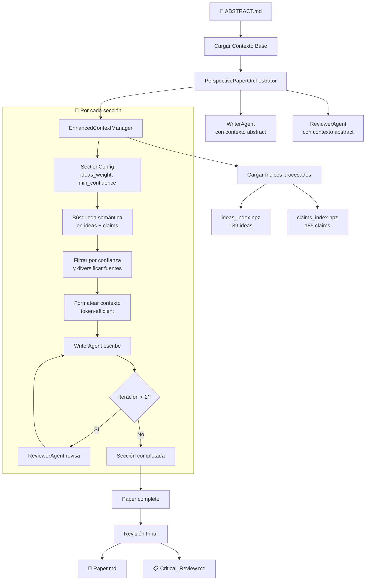
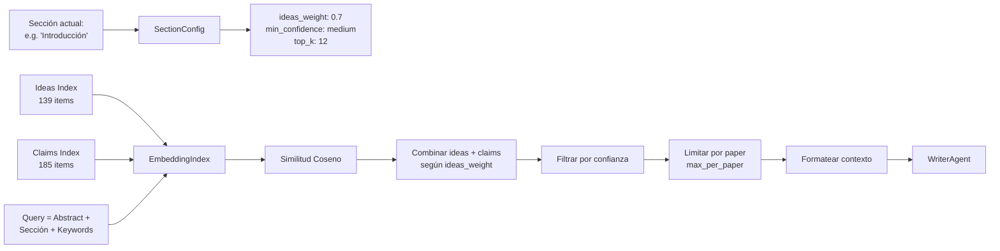
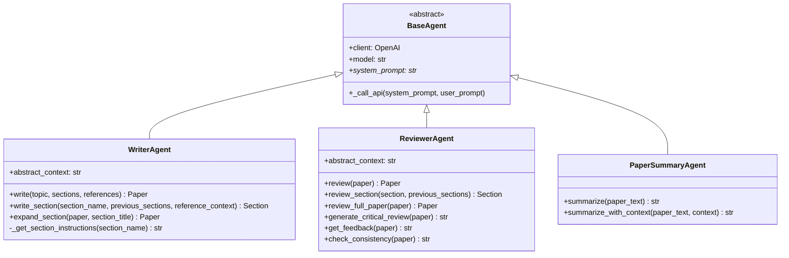
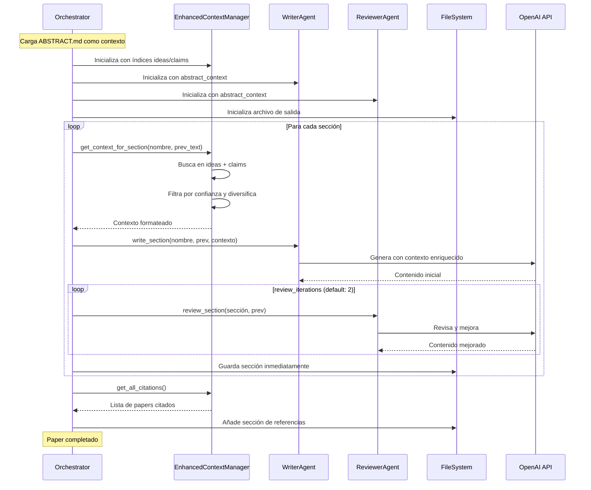
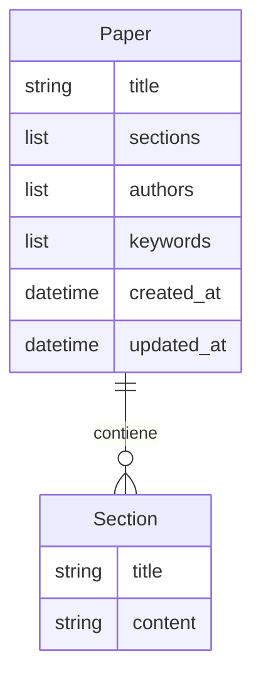
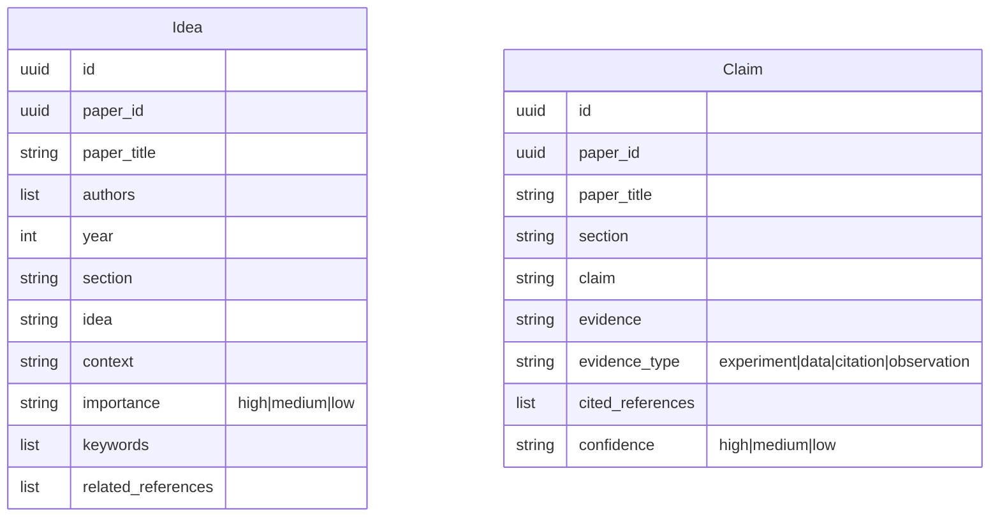

# TheAIWriter - Arquitectura del Sistema

## 📋 Resumen

TheAIWriter es un sistema de escritura académica asistida por IA especializado en **papers de perspectivas**. Utiliza agentes especializados para generar, revisar iterativamente y exportar papers científicos manteniendo coherencia con un abstract base.

### Características Principales
- **Contexto Enriquecido**: Usa índices de ideas (139) y claims (185) extraídos de papers de referencia
- **Selección Inteligente**: Configuración por sección (ideas vs claims, nivel de confianza)
- **Búsqueda Semántica**: Embeddings con OpenAI text-embedding-3-small
- **Diversidad de Fuentes**: Límite de items por paper para citas variadas

---

## 🎯 Flujo Principal: Paper de Perspectivas



---

## 🔍 Sistema de Selección Inteligente de Contexto



### Configuración por Sección

| Sección | top_k | ideas_weight | min_confidence | max_per_paper |
|---------|-------|--------------|----------------|---------------|
| Introducción | 12 | 0.7 | medium | 4 |
| Estado Actual del Arte | 18 | 0.8 | medium | 3 |
| Identificación del Problema o Brecha | 12 | 0.5 | medium | 4 |
| La Nueva Perspectiva | 15 | 0.6 | high | 5 |
| Discusión | 14 | 0.3 | high | 4 |
| Implicaciones Futuras | 12 | 0.6 | medium | 4 |
| Desafíos y Limitaciones | 10 | 0.4 | medium | 4 |
| Conclusiones | 10 | 0.5 | high | 5 |
| Declaración de Conflicto de Intereses | 0 | - | - | 0 |
| Agradecimientos | 0 | - | - | 0 |
| Referencias Bibliográficas | 0 | - | - | 0 |

**ideas_weight**: Balance entre ideas (conceptos) y claims (afirmaciones con evidencia)  
**min_confidence**: Nivel mínimo de confianza para claims (high/medium/low)  
**max_per_paper**: Máximo de items por paper para diversidad de fuentes

---

## 📚 Estructura de un Paper de Perspectivas

| Orden | Sección | Descripción |
|-------|---------|-------------|
| 0 | **Abstract** | Proporcionado por el usuario (no generado) |
| 1 | Introducción | Contexto y objetivos |
| 2 | Estado Actual del Arte | Revisión de literatura |
| 3 | Identificación del Problema o Brecha | La brecha a abordar |
| 4 | La Nueva Perspectiva | Propuesta central |
| 5 | Discusión | Argumentación detallada |
| 6 | Implicaciones Futuras | Hoja de ruta |
| 7 | Desafíos y Limitaciones | Reconocimiento honesto |
| 8 | Conclusiones | Síntesis final |
| 9 | Declaración de Conflicto de Intereses | Declaración formal |
| 10 | Agradecimientos | Reconocimientos |
| 11 | Referencias Bibliográficas | Bibliografía |

---

## 🏗️ Arquitectura de Agentes



---

## 🔄 Proceso Iterativo de Escritura-Revisión



---

## 📦 Modelo de Datos

### Paper y Secciones (Pydantic)



### Datos Procesados (JSONL)



**Idea**: Conceptos clave extraídos de papers (139 items)
- `importance`: Nivel de importancia (high/medium/low)
- `keywords`: Términos clave para búsqueda
- `context`: Cita textual del paper original

**Claim**: Afirmaciones con evidencia (185 items)
- `evidence_type`: Tipo de respaldo (experiment, data, citation, observation)
- `confidence`: Nivel de confianza en la afirmación
- `cited_references`: Referencias que soportan el claim

---

## 🎯 Componentes Principales

### Orquestación y Contexto

| Componente | Ubicación | Responsabilidad |
|------------|-----------|-----------------|
| `PerspectivePaperOrchestrator` | orchestrators/ | Orquesta el flujo completo de paper de perspectivas |
| `EnhancedContextManager` | utils/ | Contexto inteligente con ideas/claims por sección |
| `EmbeddingIndex` | embeddings/ | Índice genérico con búsqueda semántica (NPZ + metadata) |
| `ReferenceContextManager` | utils/ | Legacy: Selección de referencias (fallback) |
| `ReferenceIndex` | utils/ | Legacy: Índice de referencias con embeddings |

### Agentes de IA

| Componente | Ubicación | Responsabilidad |
|------------|-----------|-----------------|
| `BaseAgent` | agents/ | Clase base abstracta para todos los agentes |
| `WriterAgent` | agents/ | Genera contenido académico con contexto del abstract |
| `ReviewerAgent` | agents/ | Revisa secciones y genera documento crítico |
| `PaperSummaryAgent` | agents/ | Resume papers para contexto |
| `PDFExtractionAgent` | processors/ | Extrae ideas, claims y referencias de papers |

### Procesamiento de Papers

| Componente | Ubicación | Responsabilidad |
|------------|-----------|-----------------|
| `BatchProcessor` | processors/ | Procesa múltiples PDFs en lote con paralelismo |
| `PDFProcessor` | processors/ | Procesa un PDF individual: extrae → analiza → indexa |
| `ReferenceParser` | utils/ | Parsea markdown estructurado en secciones |

### Modelos de Datos (Pydantic)

| Componente | Ubicación | Responsabilidad |
|------------|-----------|-----------------|
| `Paper`, `Section` | models/ | Modelo del paper generado |
| `ProcessedPaper` | processors/models.py | Paper procesado con metadata, ideas, claims |
| `Idea`, `Claim`, `Reference` | processors/models.py | Datos extraídos de papers |
| `PaperMetadata`, `SectionData` | processors/models.py | Metadata y secciones de papers fuente |

### Lectores y Escritores

| Componente | Ubicación | Responsabilidad |
|------------|-----------|-----------------|
| `MarkdownReader` | readers/ | Lee archivos markdown |
| `PDFReader` | readers/ | Lee archivos PDF |
| `MarkdownWriter` | writers/ | Exporta paper a markdown |
| `PDFWriter` | writers/ | Exporta paper a PDF |

### Datos Procesados

| Archivo | Contenido |
|---------|-----------|
| `data/processed/indices/all_ideas.jsonl` | 139 ideas extraídas de papers |
| `data/processed/indices/all_claims.jsonl` | 185 claims con evidencia y confianza |
| `data/processed/embeddings/ideas_index.npz` | Embeddings de ideas (text-embedding-3-small) |
| `data/processed/embeddings/claims_index.npz` | Embeddings de claims |

---

## 📁 Estructura de Directorios

```
TheAIWriter/
├── src/ai_writer/
│   ├── __init__.py
│   ├── main.py                      # Punto de entrada principal
│   ├── agents/                      # Agentes de IA
│   │   ├── base_agent.py            # Clase base abstracta
│   │   ├── writer_agent.py          # Escritura con contexto
│   │   ├── reviewer_agent.py        # Revisión iterativa
│   │   └── paper_summary_agent.py   # Resumen de papers
│   ├── orchestrators/               # Orquestadores de flujo
│   │   └── perspective_paper_orchestrator.py
│   ├── processors/                  # ⭐ Procesamiento de papers
│   │   ├── batch_processor.py       # Procesamiento en lote
│   │   ├── pdf_processor.py         # Procesador de PDFs
│   │   ├── extraction_agent.py      # Agente extractor de ideas/claims
│   │   └── models.py                # Modelos: Idea, Claim, ProcessedPaper
│   ├── embeddings/                  # Sistema de embeddings
│   │   └── embedding_index.py       # Índice genérico NPZ
│   ├── models/                      # Modelos de datos
│   │   ├── paper.py                 # Paper, Section
│   │   └── reference.py             # ParsedReference
│   ├── utils/                       # Utilidades
│   │   ├── enhanced_context_manager.py  # ⭐ Contexto con ideas/claims
│   │   ├── reference_context_manager.py # Legacy selector
│   │   ├── reference_parser.py          # Parser de markdown
│   │   ├── reference_index.py           # Legacy índice
│   │   └── file_utils.py                # Utilidades de archivos
│   ├── readers/                     # Lectores
│   │   ├── markdown_reader.py
│   │   └── pdf_reader.py
│   ├── writers/                     # Exportadores
│   │   ├── markdown_writer.py
│   │   └── pdf_writer.py
│   └── scripts/                     # Scripts ejecutables
│       ├── generate_perspective_paper.py
│       ├── run_batch_processing.py  # Procesa papers → ideas/claims
│       ├── process_papers.py        # Procesamiento individual
│       └── process_powerpoint.py    # Generación de presentaciones
├── config/                          # Configuración
│   ├── __init__.py
│   └── settings.py                  # Settings con Pydantic
├── data/
│   ├── audio/                       # Archivos de audio (TTS)
│   ├── processed/                   # ⭐ Datos procesados
│   │   ├── processing_status.json   # Estado del procesamiento
│   │   ├── papers/                  # Papers procesados por UUID
│   │   ├── indices/
│   │   │   ├── all_ideas.jsonl      # 139 ideas extraídas
│   │   │   ├── all_claims.jsonl     # 185 claims con evidencia
│   │   │   └── all_references.jsonl # Referencias extraídas
│   │   └── embeddings/
│   │       ├── ideas_index.npz      # Embeddings de ideas
│   │       ├── ideas_metadata.json
│   │       ├── claims_index.npz     # Embeddings de claims
│   │       ├── claims_metadata.json
│   │       ├── references_index.npz
│   │       └── references_metadata.json
│   ├── references/
│   │   ├── markdown/                # Referencias en markdown
│   │   │   ├── ABSTRACT.md          # ⭐ Abstract base (requerido)
│   │   │   └── *.md                 # Papers convertidos
│   │   └── pdfs/                    # PDFs originales
│   └── output/
│       ├── drafts/                  # Borradores
│       ├── final/                   # Papers finales generados
│       └── powerpoint/              # Presentaciones generadas
├── tests/                           # Tests
│   ├── conftest.py
│   ├── test_agents/
│   ├── test_readers/
│   └── test_writers/
├── docs/                            # Documentación
│   └── architecture.md
├── pyproject.toml                   # Configuración del proyecto
├── README.md
├── .env                             # Variables de entorno (API keys)
└── .env.example                     # Ejemplo de configuración
```

---

## 🚀 Uso

```bash
# Procesar papers de referencia (extraer ideas y claims)
python -m ai_writer.scripts.run_batch_processing --report

# Generar un paper de perspectivas
python -m ai_writer.scripts.generate_perspective_paper
```

**Requisitos:**
1. Archivo `data/references/markdown/ABSTRACT.md` con el abstract del paper
2. Referencias estructuradas en `data/references/markdown/*.md`
3. Datos procesados en `data/processed/` (generados por batch processing)

**Modo Enhanced (por defecto):**
- Usa `EnhancedContextManager` con índices de ideas/claims
- Configuración específica por sección
- Carga embeddings desde NPZ (instantáneo)

**Modo Legacy (fallback):**
```python
orchestrator = PerspectivePaperOrchestrator(use_enhanced_context=False)
```
- Usa `ReferenceContextManager` con referencias completas
- Se activa automáticamente si no existen los índices procesados
