# Arquitectura de Generación de Esquema (Outline)

Este documento describe la implementación actual del proceso de generación de esquema para papers de perspectiva.

## Diagrama de Flujo

```mermaid
flowchart TB
    subgraph INPUT["📥 ENTRADA"]
        ABSTRACT["📄 ABSTRACT.md<br/>Tesis del paper"]
        EMBEDDINGS["🧮 Embeddings<br/>ideas_index.npz<br/>ideas_metadata.json<br/>(3733 ideas)"]
    end

    subgraph PHASE1["🔬 FASE 1: Análisis de Clusters"]
        direction TB
        LOAD["Cargar embeddings<br/>(1536 dims)"]
        KMEANS["KMeans Clustering<br/>(n_clusters=10)"]
        TFIDF["TF-IDF sobre textos<br/>de cada cluster"]
        TOPICS["ClusterTopic[]<br/>• label: 'Agents + LLM'<br/>• keywords: ['agent', 'llm', ...]<br/>• centroid: vector 1536d<br/>• size: N items"]
        
        LOAD --> KMEANS --> TFIDF --> TOPICS
    end

    subgraph PHASE2["📋 FASE 2: Planificación"]
        direction TB
        MAPPING["Mapear Secciones → Topics<br/>Introducción → [top 3 topics]<br/>Estado del Arte → [all topics]<br/>..."]
        SEARCH["🔍 Búsqueda por Centroide<br/>Por cada sección:<br/>cosine_similarity(centroid, embeddings)<br/>→ top-k ideas más cercanas"]
        IDEAS["Ideas por Sección<br/>• Introducción: 8 ideas<br/>• Estado del Arte: 8 ideas<br/>• ... (64 ideas total)"]
        PROMPT["Construir Prompt<br/>• Abstract<br/>• Topics summary<br/>• IDEAS REALES por sección<br/>• Secciones + #párrafos"]
        GPT["GPT-5.1<br/>response_format: json_object<br/>max_tokens: 6000"]
        PARSE["Parsear JSON<br/>→ PaperOutline"]
        
        MAPPING --> SEARCH --> IDEAS --> PROMPT --> GPT --> PARSE
    end

    subgraph SECTIONS["📑 SECCIONES CONFIGURADAS"]
        direction LR
        S1["Introducción<br/>2-3 párrafos"]
        S2["Estado del Arte<br/>3-5 párrafos"]
        S3["Problema/Brecha<br/>2-3 párrafos"]
        S4["Nueva Perspectiva<br/>3-4 párrafos"]
        S5["Discusión<br/>3-5 párrafos"]
        S6["Implicaciones<br/>2-3 párrafos"]
        S7["Desafíos<br/>2-3 párrafos"]
        S8["Conclusiones<br/>1-2 párrafos"]
    end

    subgraph OUTPUT["📤 SALIDA"]
        OUTLINE_MD["📄 {title}_outline.md"]
        OUTLINE_JSON["📄 {title}_outline.json"]
    end

    subgraph OUTLINE_STRUCT["📝 Estructura PaperOutline"]
        direction TB
        PAPER["PaperOutline<br/>• title<br/>• abstract<br/>• thesis_statement"]
        SECTION["SectionOutline[]<br/>• section_name<br/>• section_purpose"]
        PARA["ParagraphOutline[]<br/>• key_idea (de literatura)<br/>• supporting_points[]<br/>• suggested_sources[]"]
        
        PAPER --> SECTION --> PARA
    end

    %% Conexiones principales
    ABSTRACT --> PHASE1
    EMBEDDINGS --> LOAD
    TOPICS --> PHASE2
    TOPICS --> MAPPING
    ABSTRACT --> PROMPT
    SECTIONS --> PROMPT
    PARSE --> OUTPUT
    PARSE --> OUTLINE_STRUCT

    %% Estilos
    classDef input fill:#e1f5fe,stroke:#01579b
    classDef phase1 fill:#fff3e0,stroke:#e65100
    classDef phase2 fill:#f3e5f5,stroke:#7b1fa2
    classDef output fill:#e8f5e9,stroke:#2e7d32
    classDef struct fill:#fce4ec,stroke:#c2185b
    classDef search fill:#e3f2fd,stroke:#1565c0
    
    class ABSTRACT,EMBEDDINGS input
    class LOAD,KMEANS,TFIDF,TOPICS phase1
    class MAPPING,SEARCH,IDEAS,PROMPT,GPT,PARSE phase2
    class OUTLINE_MD,OUTLINE_JSON output
    class PAPER,SECTION,PARA struct
```



## Componentes

| Componente | Archivo | Responsabilidad |
|------------|---------|-----------------|
| **ClusterAnalyzer** | `utils/cluster_analyzer.py` | Extrae temas + busca ideas por centroide |
| **PlannerAgent** | `agents/planner_agent.py` | Genera outline con ideas reales de literatura |
| **PaperOutline** | `models/outline.py` | Modelo de datos para el esquema |
| **run_outline_generator** | `scripts/run_outline_generator.py` | Script de ejecución (Fase 1 + 2) |

## Flujo de Datos Mejorado

1. **Entrada**: Abstract del paper + embeddings pre-procesados de 41 papers
2. **Fase 1**: 
   - Carga 3733 embeddings de ideas (1536 dimensiones)
   - Aplica KMeans para crear clusters
   - Extrae keywords con TF-IDF por cluster
   - Genera `ClusterTopic` con label, keywords y **centroide**
3. **Fase 2 (MEJORADA)**:
   - **Mapea secciones a topics** según propósito de cada sección
   - **Busca ideas por centroide**: `cosine_similarity(centroid, embeddings)`
   - Recupera ~8 ideas relevantes por sección (64 total)
   - Construye prompt con **ideas reales de la literatura**
   - Llama a GPT-5.1 con contexto fundamentado
   - Parsea respuesta en estructura `PaperOutline`
4. **Salida**: Archivos MD y JSON en `data/output/drafts/`

## Nuevos Métodos en ClusterAnalyzer

```python
# Buscar ideas cercanas a un centroide
def search_by_centroid(centroid, top_k=5, embed_type="ideas") -> list[dict]

# Buscar por nombre de topic
def search_by_topic(topic_label, top_k=5) -> list[dict]

# Obtener ideas para todas las secciones del paper
def get_ideas_for_sections(topics, section_topic_mapping, ideas_per_section=8) -> dict[str, list[dict]]
```

## Mapeo Sección → Topics

| Sección | Topics Asignados | Lógica |
|---------|-----------------|--------|
| Introducción | Top 3 por tamaño | Temas principales |
| Estado del Arte | Todos | Revisión completa |
| Problema/Brecha | Mitad inferior | Nichos menos explorados |
| Nueva Perspectiva | Top 4 | Conceptos centrales |
| Discusión | Todos | Análisis amplio |
| Implicaciones | Top 5 | Temas emergentes |
| Desafíos | Alternados | Diversidad |
| Conclusiones | Top 3 | Síntesis |

## Ejecución

```bash
# Solo generar outline (Fase 1 + 2)
python src/ai_writer/scripts/run_outline_generator.py \
    --title "Mi Paper" \
    --clusters 10 \
    --refine-iterations 0

# Continuar con escritura (Fase 3)
python src/ai_writer/scripts/run_paper_from_outline.py \
    --outline "Mi_Paper_outline.json"
```
